# Viral Short Machine — Automated Faceless Shorts for Rapid Content Production 🎬🚀

**Viral Short Machine — Automated faceless shorts for marketing & advertising teams**

---

[](#) [](#) [](#) [](#) [](#)

---

## 🚀 Project Overview

* A coordinated **4-flow n8n automation** that converts one Google Sheet row (Main Character + Opponent category) into a fully rendered 30s short and publishes it.
* Flows included:

  1. **Create Scenes** — generate 8 opponent matchups.
  2. **Create Close-Up Images** — generate cinematic close-ups for both animals.
  3. **Create Winner Image** — generate a winner/loser aftermath background.
  4. **Render Video (Creatomate)** — assemble, render & publish to Blotato → socials.
* Built for marketing/advertising teams to massively scale short-form content production with consistent aesthetics and low per-video cost.

---

## 🧭 Workflow Diagram

> 

---

## 💡 Key Client Pain Points & How We Solve Them

* **Pain:** Manual creative pipeline is slow and costly.
  **Solution:** Fully automated prompt → image → render → publish pipeline in n8n.
* **Pain:** Visually inconsistent outputs across videos.
  **Solution:** Centralized prompt templates + single Creatomate template ensure consistent style.
* **Pain:** Multiple tools to manage and stitch together.
  **Solution:** Google Sheets acts as single source of truth; n8n orchestrates everything.
* **Business gains (conservative):**

  * Throughput ↑ **8–10×** (idea → published short).
  * Cost reduction ≈ **>70%** vs manual production.
  * Time saved ≈ **2–4 hours** manual effort replaced per short.

---

## 💰 Project Cost & ROI (Per Video)

* **Prompt Gen (GPT-4.1-mini):** $0.01
* **Image Gen (PiAPI Flux) — 24 images @ $0.015:** $0.36
* **Creatomate render (amortized):** $0.35
* **Blotato publish (flat monthly):** $0.00 per video
* **Total estimated per short:** **$0.72**

> Formula: `0.01 + (0.015 * 24) + 0.35 = 0.72`

---

## 🧭 Full Mermaid Flow (Steps 1 → 26)

```mermaid
flowchart TD
  subgraph Flow1["Flow 1 — Create Scenes"]
    A1["Step 1 - Schedule Trigger"]
    A2["Step 2 - Google Sheets (Get Main Character - Status To Do)"]
    A3["Step 3 - AI Agent (Scene Creator Agent - GPT-4.1-mini)"]
    A4["Step 4 - Edit Field (Main Character & Opponents Array)"]
    A5["Step 5 - Split Out (Opponents Array)"]
    A6["Step 6 - Merge (Combine Main Character with Opponents)"]
  end

  subgraph Flow2["Flow 2 — Create Close-Up Images"]
    B1["Step 7 - AI Agent (Image Prompt Generator - GPT-4.1-mini)"]
    B2["Step 8 - Split Out (8 to 16 Prompts)"]
    B3["Step 9 - HTTP POST (PiAPI txt2img)"]
    B4["Step 10 - Wait 90s"]
    B5["Step 11 - HTTP GET (PiAPI Task Result)"]
    B6["Step 12 - Aggregate & Update Google Sheets (M1..O8)"]
  end

  subgraph Flow3["Flow 3 — Create Winner Image"]
    C1["Step 13 - AI Agent (Winners Image Prompt - GPT-4.1)"]
    C2["Step 14 - HTTP POST (PiAPI Winner txt2img)"]
    C3["Step 15 - Wait 90s"]
    C4["Step 16 - HTTP GET (PiAPI Winner Result)"]
    C5["Step 17 - Aggregate (Winner Data)"]
    C6["Step 18 - Update Google Sheets (W1..W8)"]
  end

  subgraph Flow4["Flow 4 — Render Video (Creatomate) & Publish"]
    D1["Step 19 - Merge (CloseUps + Winners)"]
    D2["Step 20 - Google Sheets (Get All Image URLs)"]
    D3["Step 21 - HTTP POST (Creatomate Render Video)"]
    D4["Step 22 - Wait 90s"]
    D5["Step 23 - HTTP GET (Rendered Video URL)"]
    D6["Step 24 - Google Sheets (Update Status + Final Video)"]
    D7["Step 25 - HTTP POST (Upload to Blotato)"]
    D8["Step 26 - Publish to Instagram / TikTok / YouTube"]
  end

  A1 --> A2 --> A3 --> A4 --> A5 --> A6
  A6 --> B1 --> B2 --> B3 --> B4 --> B5 --> B6
  B6 --> C1 --> C2 --> C3 --> C4 --> C5 --> C6
  C6 --> D1 --> D2 --> D3 --> D4 --> D5 --> D6 --> D7 --> D8
```



---

## 🔎 Node-by-Node Configuration 

### **Flow 1 — Create Scenes**

**Step 1 — Schedule Trigger**

* **Purpose:** Kick off the automation on schedule (cron).
* **Inputs:** N/A.
* **Example output:** trigger event.

**Step 2 — Google Sheets — Get Main Character : Status (To Do)**

* **Purpose:** Get first row where `Status = "To Do"` from `34. Viral Shorts / Sheet1`.
* **Parameters:**

  * Resource: Sheet within Document
  * Operation: Get Row(s)
  * Document: **34. Viral Shorts** (Sheet1)
  * Filters: Column `Status` = `To Do`
  * **Option:** Return only **First Matching Row**
* **Example output (sample row):**

  ```
  row_number: 3
  Main Character: Wolf
  Opponents: Animals
  Status: To Do
  Final Video: (empty)
  M1..O1..W1 .. M8..O8..W8: (empty)
  ```

**Step 3 — AI Agent — Scene Creator Agent (GPT-4.1-mini)**

* **Purpose:** Generate **8** distinct opponents for the main character.
* **Source prompt (user message):**

  ```
  Main Character: {{ $json['Main Character'] }}
  Opponents: {{ $json.Opponents }}
  ```

  *Example resolved:* `Main Character: Wolf  Opponents: Animals`
* **Structured Output Parser:** `scene1..scene8` JSON example.
* **Example AI output:**

  ```json
  {
    "scene1":"Grizzly Bear","scene2":"Mountain Lion","scene3":"Red Fox",
    "scene4":"Bald Eagle","scene5":"Alligator","scene6":"Rattlesnake",
    "scene7":"Moose","scene8":"Wild Boar"
  }
  ```
* **📜 Full System Message** :
```
# Overview
You are an AI agent that creates fight scene matchups.

## Instructions
Given a main character and a category of opponents, generate a list of eight different opponents from that category. Each opponent should be suitable to fight the main character and come from a different environment, background, or type within the category.

Do not include descriptions, adjectives, or extra context. Only list the opponent names, one per scene, labeled clearly.

## Output Format:
Only output the opponent.

Scene 1: [Opponent]
Scene 2: [Opponent]
Scene 3: [Opponent]
Scene 4: [Opponent]
Scene 5: [Opponent]
Scene 6: [Opponent]
Scene 7: [Opponent]
Scene 8: [Opponent]
```

**Step 4 — Edit Field(s) — Map Main Character & Opponents Array**

* **Purpose:** Prepare downstream fields.
* **Actions:**

  * `mainCharacter = {{ $('Get Main Character : Status (To Do)').item.json['Main Character'] }}` → e.g., `Wolf`
  * `opponents = ['{{ $json.output.scene1 }}', ..., '{{ $json.output.scene8 }}']`

**Step 5 — Split Out & Merge (produce pairs)**

* **Purpose:**

  * Split opponents array into 8 items; then merge with `mainCharacter` to produce 8 pair items (Wolf vs each opponent).
* **Merge Mode:** All Possible Combinations (results: 8 combined items).

---

### **Flow 2 — Create Close-Up Images**

**Step 6 — AI Agent — Image Prompt Generator (GPT-4.1-mini)**

* **Purpose:** Generate **two** close-up prompts per pair: `mainCharacterCloseUp` & `opponentCloseUp` (hyper-realistic, roaring, mouth open, direct eye contact).
* **User prompt:**

  ```
  Main Animal: {{ $json.mainCharacter }}
  Opponent: {{ $json.opponents }}
  ```

  *Example:* `Main Animal: Wolf  Opponent: Grizzly Bear`
* **Structured Output Parser:** `{ "mainCharacterCloseUp": "...", "opponentCloseUp": "..." }`

* **📜 Full System Message** (raw):
```
# System Prompt

You are an AI agent that generates high-quality text-to-image prompts for a photorealistic image generation API.

## Task
Given a **main animal** and an **opponent**, generate two separate close-up image prompts optimized for cinematic AI-generated images.

## Output
Output two close up prompts. One for the main animal, one for the opponent.

Each prompt must make the animal look:
- hyper-realistic and photorealistic
- fierce, angry, intimidating, threatening
- Focused on high detail: skin/fur/scales, lighting, facial expression, and textures
- Roaring with mouth wide open
- Designed to make the animal look powerful, aggressive, and dramatic
- The animal should be looking into the camera

Do not include any background story, camera specifications, or extra formatting. Only return two clear and vivid text-to-image prompts—one for each animal.
```

* **Example output (one variant):**

  ```json
  {
    "mainCharacterCloseUp": "A hyper-realistic, photorealistic close-up of a fierce gorilla roaring ...",
    "opponentCloseUp": "A hyper-realistic, photorealistic close-up of a jaguar roaring ..."
  }
  ```

**Step 7 — Split Out (8 → 16 prompts)**

* **Purpose:** Expand each pair into 2 prompts (main + opponent) → 16 items.

**Step 8 — HTTP POST → PiAPI (Generate Close-Up Image)**

* **Purpose:** Submit each prompt to PiAPI txt2img.
* **Request body:**

  ```json
  {
    "model": "Qubico/flux1-dev",
    "task_type": "txt2img",
    "input": {
      "prompt": "{{ $json.output }}",
      "width": 1024,
      "height": 1024
    }
  }
  ```
* **Output:** `task_id`.

**Step 9 — Wait (90s)**

* **Purpose:** Allow PiAPI time to generate images.

**Step 10 — HTTP GET → PiAPI (Get Task)**

* **Purpose:** Poll PiAPI using `task_id` for `output.image_url`.

**Step 11 — Aggregate**

* **Purpose:** Collect all 16 returned image entries under `data` array.

**Step 12 — Google Sheets — Add Close-Up Image Link**

* **Purpose:** Update row in `34. Viral Shorts / Sheet1` with `M1..M8` (main close-ups) and `O1..O8` (opponent close-ups).
* **Note:** Some image entries may be `undefined` if generation failed — add validation step before rendering (recommended).

---

### **Flow 3 — Create Winner Image**

**Step 13 — AI Agent — Winners Image Prompt (GPT-4.1)**

* **Purpose:** For each pair, produce **one** single-paragraph photorealistic prompt showing the **aftermath** and deciding which animal wins. Winner must be standing on the loser; loser must be described as **"lifeless"**.
* **User prompt:**

  ```
  Animal 1: {{ $('Merge').item.json.mainCharacter }}
  Animal 2: {{ $('Merge').item.json.opponents }}
  ```

  *Example:* `Animal 1: Wolf  Animal 2: Grizzly Bear`
* **📜 Full System Message** (raw):

```
# Overview
You are an AI agent that creates text-to-image prompts for a photorealistic image generation API. Your goal is to create a single cinematic scene that shows the aftermath of a battle between two aniamals.

## Task:
Given two animals, write one vivid prompt for a photorealistic image that shows the aftermath of a fight. Decide which animal is the winner, it should be realistic based on the strengths of each animal.

## Prompt Guidelines
1. The winner must be standing on top of the loser in a dominating stance. They should have visible battle scars.
2. The winner should staring at the camera, roaring, mouth wide open, looking fierce, intimidating, and terrifying.
3. The loser must appear dead, the word "lifeless" should be used. The loser should have visible wounds and battle scars.
5. Both animal must be clearly visible, with the winner’s dominant stance making it immediately obvious who won the fight.
6. The image must be photorealistic, with high attention to lighting, textures, and atmosphere. It should clearly display the aftermath of a brutal fight where the loser was injured.
7. The two animals must be the main focus, filling most of the frame. The background should only enhance the realism and not distract.
8. Each animal must be visually distinct and easily identifiable based on real-world appearance. The prompt must clearly describe each animal by name and include key traits that help the model render them correctly and differently.
9. Use species-specific language to avoid confusion. Do not refer to both animals as just “beasts” or “creatures.” Always name them: "the lion" and "the wolf" — and refer back to them by name in the prompt.

## Output: Return one single paragraph as the final prompt.

## Good Example Image Prompts
1) In a photorealistic, cinematic scene, a massive polar bear stands triumphantly over the lifeless body of a jaguar in a snow-dusted landscape. The polar bear, its thick white fur spattered with streaks of blood and dust, dominates the frame, towering above the slack, motionless form of the jaguar sprawled beneath its heavy paw. The polar bear’s mouth is wide open in a terrifying roar, sharp teeth glistening, and its dark, fierce eyes stare straight into the camera, exuding raw power and victory. The jaguar’s spotted golden body lies limp and completely still, head tilted to the side, eyes fully closed with no sign of life, jaws parted loosely, and its muscular limbs splayed carelessly on the icy ground. Every detail—from the jaguar’s distinctive rosettes to the polar bear’s thick, textured fur and massive claws—is rendered in sharp, lifelike clarity beneath cold, dramatic lighting, making it unmistakably clear that the polar bear is the fearsome victor of this brutal encounter.
```

**Step 14 — HTTP POST → PiAPI (Generate Winner Image)**

* **Purpose:** Send winner prompt to PiAPI.
* **Body:** Similar to close-ups but `width: 540, height: 960`.

**Step 15 — Wait (90s)**

* **Purpose:** Wait for PiAPI to finish.

**Step 16 — HTTP GET → PiAPI (Get Winner Task)**

* **Purpose:** Retrieve winner image `output.image_url`.

**Step 17 — Aggregate winners**

* **Purpose:** Collect 8 winner images into `data` array.

**Step 18 — Google Sheets — Add Winners Image**

* **Purpose:** Update `W1..W8` with winner image URLs for that `Main Character`.

---

### **Flow 4 — Render Video (Creatomate) & Publish**

**Step 19 — Merge (CloseUps + Winners)**

* **Purpose:** Combine Close-Up image fields (M1..O8) + Winners (W1..W8) using **Position** combine so that `M1/O1/W1` map to slide 1, `M2/O2/W2` → slide 2, etc.

**Step 20 — Google Sheets — Get: ALL Image URLs**

* **Purpose:** Read the row for `Main Character` to fetch `M1..M8`, `O1..O8`, `W1..W8` and other metadata.
* **Filter:** `Main Character = {{ $json['Main Character'] }}`

**Step 21 — HTTP POST → Creatomate (Render Video)**

* **Purpose:** Render final short with Creatomate template.
* **Endpoint:** `https://api.creatomate.com/v2/renders`
* **Headers:** `Authorization: Bearer <token>` (store token in n8n credentials).
* **Body (JSON) highlights:** include `template_id: "1b2e12c7-789e-4161-bb7f-7a7c98941b63"` and `modifications` object mapping:

  * `Top-Image-1.source = {{ $json.O1 }}`, `Bottom-Image-1.source = {{ $json.M1 }}`, `Full-Background-Image-1.source = {{ $json.W1 }}`, `Middle-Text-1.text = "VS"` (and so on for 1..8)
  * `Music.source` set to your Drive audio link.

**Step 22 — Wait (90s)**

**Step 23 — HTTP GET → Creatomate rendered resource**

* **Purpose:** GET `{{ $json.url }}` from Creatomate to receive final video URL.

**Step 24 — Google Sheets — Update (Status + Final Video Link)**

* **Purpose:** Update the row: `Status = Created`, `Final Video = {{ $json.url }}`.

**Step 25 — HTTP POST → Upload to Blotato**

* **Purpose:** Send `{ "url": "{{ $json['Final Video'] }}" }` to Blotato media endpoint for scheduling/publishing.

**Step 26 — Social Publishing**

* **Purpose:** Use Blotato response (or direct social APIs) to publish to Instagram / TikTok / YouTube. (These steps branch from Step 25.)

---

## 📁 Free Workflow Template

* **Download:** [n8n workflow JSON](https://github.com/SachinSavkare/VIral-Shorts-Machine-n8n/blob/main/34.%20Viral%20Shorts%20Machine.json)

---

## 👥 Author & Contact

**Sachin Savkare**
📧 [sachinsavkare08@gmail.com](mailto:sachinsavkare08@gmail.com)

---

